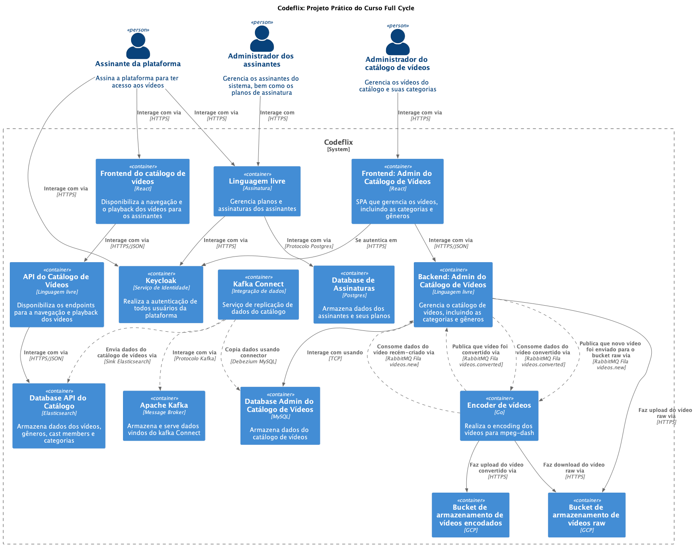

# Arquitetura do Projeto Prático - Codeflix

C4 Model - C2 - Containers

### Decisões de Projeto e Arquitetura
---
#### Principais funcionalidades do Codeflix
- Similar à Netflix
- Assinatura do serviço pelos clientes
- Catálogo de vídeos para navegação
- Reprodução (playback) de vídeos
- Busca fulltext no catálogo
- Processamento e encoding de vídeos
  - Processamento refere-se a qualquer tratamento ou manipulação nos vídeos, como cortes ou compressão.
  - Encoding é a transformação do vídeo para outro formato ou codec, tornando-o compatível com diferentes dispositivos.
  - Processamento é mais amplo; encoding é um tipo específico de processamento.
- Administração do catálogo de vídeos
  - Criar vídeo, categorias e membros do elenco (cast members)
- Administração do serviço de assinatura
  - Plano
- Autenticação

---
#### Microserviços
- Arquitetura baseada em microserviços.
  - Possibilita o uso da tecnologia mais adequada para cada contexto.
  - Exemplo: transcoding de vídeo com Go.
- Cada microserviço terá seu próprio processo de CI/CD.
  - CI/CD (Integração Contínua e Entrega Contínua).
  - Sempre que uma nova versão for publicada (ex: criação de um pull request na - branch develop),
    - os testes serão executados para garantir o funcionamento do serviço.
    - Ao incorporar na master, o deploy será realizado em produção.

#### Escalabilidade 
- O processo de escala poderá ser configurado a nível de microserviço.
- Escalabilidade horizontal.
  - Escalabilidade refere-se à capacidade do sistema de aumentar ou diminuir recursos (como servidores) para lidar com variações de carga, podendo ser vertical (mais potência por máquina) ou horizontal (mais máquinas), garantindo desempenho, disponibilidade e eficiência de custos.
- Aumento no número de pods utilizando orquestrador de containers, como o Kubernetes.
- Microserviços são efêmeros e stateless.
- Assets são armazenados em cloud storage.
- Autoscaling com HPA (Horizontal Pod Autoscaler).

#### Service Discovery
  - Sem Consul, utilizando o service discovery embutido no Kubernetes.

#### Consistência eventual
- base de dados propria para cada microserviço
  - (replicação, duplicação) dos dados com 	apache kafka + kafka connect
    - ingestão e integração dos dados
    - da administração de videos para o catalogo de videos

#### Mensageria
- comunicação entre microserviços
- RabbitMQ (comunicação via fila, comunicação assíncrona)

#### Resiliência
- Em caso de queda de um microserviço, o uso de filas na comunicação entre microserviços permite retomar o processamento posteriormente.
- Contrato de mensagens e uso de dead-letter-queue para tratamento de mensagens não processadas.
- self-healing e health check.
  - Utilização de Kubernetes, service mesh (Istio), circuit breaker, liveness e readiness probes.

#### Autenticação e Autorização
- Keycloak
  - Login customizado com React.
- RSA256: chave privada e pública do Keycloak, validação do token diretamente no microserviço.
- ACL (papéis e permissões).
- OAuth 2.0 + OpenID Connect, fluxo de autenticação.

---

#### Microserviços
- backend admin do catalogo de videos
  - falar com banco de dados
  - administrar
  - salvar os dados dos videos, generos, categorias, cast members, …
  - banco mysql
- frontend admin do catalogo de videos
    - frontend do administrador do catalogo de video
    - aplicação que fala com a api desse back-end, pra conseguir fazer ação, cadastrar, …
- encoder de video
  - ele pego os videos que são enviados via o nosso back-end de administração de videos, e vai fazer o encoding e vai salvar esses dados num bucket
- backend api do catalogo de videos
  - poderia ser considerada como um bff(backend for front-end)
      - eu posso criar diversos back-ends, trazendo dados especificos de acordo com o tipo de front-end que vai ser conectar nela
  - vai disponibilizar uma serie de apis para conseguir realizar consultas e pegar os dados necessarios, pra conseguir fazer o playback do video
  - esse backend utiliza um banco de dado diferentes do banco do backend de admin de catalogo
  - banco: elasticsearch
      - permiti fulltext search
      - traz os dados de uma forma melhor
- front-end do catalogo
  - usuario vai navegar no catalogo de video, clicar e assistir video
- microserviço de asssinatura do codeflix pelo cliente
  - cliente vai querer assinar, se cadastrar, contratar um plano, e quando der certo, ele vai poder acessar o front-end de catalogo
- keycloak
  - autenticação entre microsserviços
- rabbitmq
  - comunicação assincrona entre os microsserviços
  - filas
  - tarefa de encoder de video
- apache kafka e kafka connect
  - replicação de dados
  - replicação de dados que estão no backend do admin para o catalogo em elasticsearch, a gente vai utilizar o apache kafka com o kafka connect para realizar toda essa tarefa

--- 
#### Desenvolvimento e deploy
- ambiente de desenvolvimento
	- docker
		- criação rapida
		- ambientes sempre os mesmos
		- criar recursos perifericos rapidos
		- multistage building para produção, ...
- ci/cd: continuos integration, continuos delivery/deploy
  - github actions
  - ci
    - pullrequest na development branch ativa pipeline de ci
      - sobe aplicação usando docker
      - executa os testes
      - utilizar o sonarcube: verificar debito tecnico ou questoes de segurança
  - cd
    - apos o merge do pullrequest, o processo de cd acontece
    - gitops + argocd
      - gera imagem docker da aplicação
        - realiza o upload da imagem em um container registry
        - executa o deploy no kubernetes
        - kubernetes baixa a imagem do container registry
        - a aplicação roda no orquestrador de containers kubernetes
- kubernetes
  - cluster kubernetes gerenciado
    - aws, gcp, azure
  - o deploy da aplicação
    - infra as code
      - criar cluster de forma automatizada
  - startup, readiness e liveness probe para self healing
    - verificar se aplicação está pronta para ficar disponivel no kubernetes
  - horizontal pod autoscaler (hpa) para escalar horizontalmente a aplicação
- cloud providers
  - subir os clusters do kubernetes
    - IaC(Infra as Code)
      - terraform, Ansible
  - providers
    - utilizar os cloud providers aws, microsoft azure, cgp